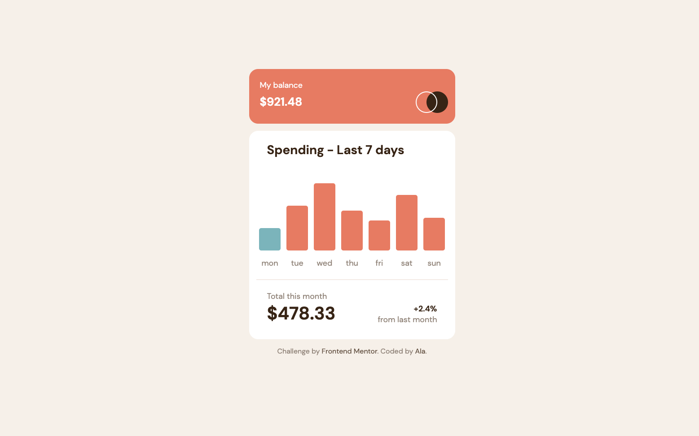
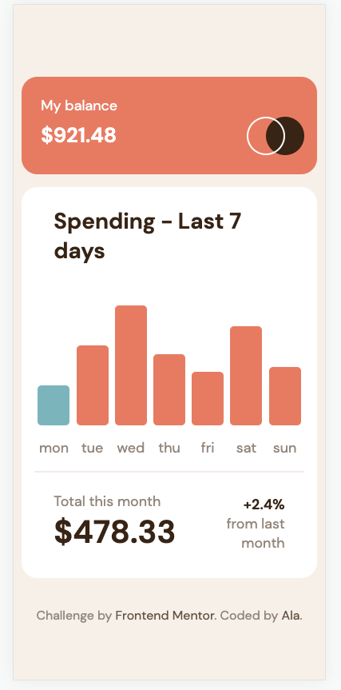

# Frontend Mentor - Expenses chart component solution

This is a solution to the [Expenses chart component challenge on Frontend Mentor](https://www.frontendmentor.io/challenges/expenses-chart-component-e7yJBUdjwt). Frontend Mentor challenges help you improve your coding skills by building realistic projects. 

## Table of contents

- [Overview](#overview)
  - [The challenge](#the-challenge)
  - [Screenshot](#screenshot)
  - [Links](#links)
- [My process](#my-process)
  - [Built with](#built-with)
  - [What I learned](#what-i-learned)
  - [Useful resources](#useful-resources)
- [Author](#author)

## Overview

### The challenge

Users should be able to:

- View the bar chart and hover over the individual bars to see the correct amounts for each day
- See the current day’s bar highlighted in a different colour to the other bars
- View the optimal layout for the content depending on their device’s screen size
- See hover states for all interactive elements on the page
- **Bonus**: Use the JSON data file provided to dynamically size the bars on the chart

### Screenshot

### Links

- Solution URL: [Expenses Chart](https://github.com/alawllm/fm_expenses_chart_component)
- Live Site URL: [Netlify](https://expenses-chart-fm.netlify.app)

## My Process

### Built with

- Semantic HTML5 markup
- CSS custom properties
- Flexbox
- Mobile-first workflow

### What I learned

After some time away from pure JS/CSS/HTML, it was a great project to refresh some knowledge. Specifically:

- storing data in HTML data attributes
- working with JSON
- HTML structure
- making a bar chart in pure JS

### Useful resources

- [GitHub Gdsimoes](https://github.com/gdsimoes/expenses-chart-component/tree/main) - This helped me structure my JS functions. I did not follow this solution, but analyzing it at the beginning of the project helped me to get ideas what to be mindful of later.
- [Chat GPT](https://chat.openai.com) - I used Chat GPT as my CSS mentor. It is a great resource to explain concepts quickly, clearly and with examples. 

## Author

- Frontend Mentor - [@alawllm](https://www.frontendmentor.io/profile/alawllm)
- GitHub - [@alawllm](https://github.com/alawllm)

